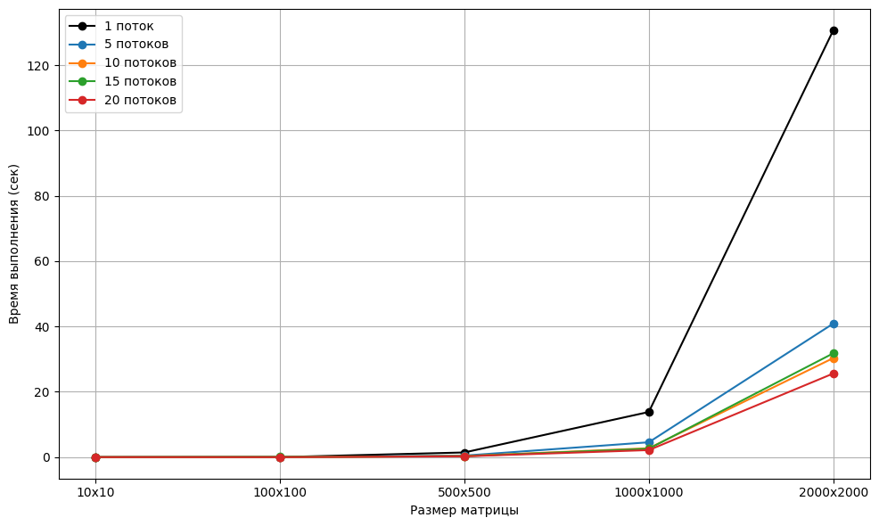
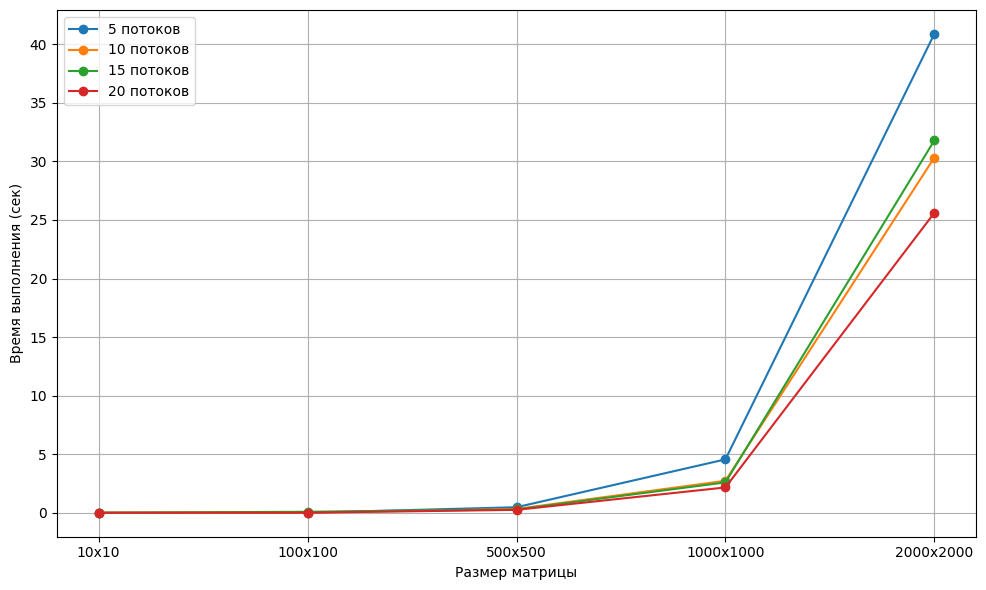

# Отчет по дисциплине "Параллельное программирование"

## Лабораторная работа №2

## Задание
Модифицировать программу из л/р №1 для параллельной работы по технологии OpenMP.

## Реализация
В функции multiplyMatrix добавлены директивы:
1. #pragma omp parallel for для параллелизации внешнего цикла
2. #pragma omp parallel for reduction(+:sum) для параллелизации внутреннего цикла с редукцией по переменной sum.
3. Все расчеты выполнены корректно: с помощью программы на Python  считывается файл с ответом и сравнивает его с получненной библиотекой "numpy" матрицей. 

## Результаты
Как видно из графиков, использование библиотеки OpenMP позволяет ускорить вычисления в среднем в 3–5 раз по сравнению с последовательным выполнением.

Для анализа влияния количества потоков на эффективность оптимизации были проведены эксперименты с использованием 5, 10, 15 и 20 потоков. Для небольших размеров матриц (например, 100x100) увеличение количества потоков незначительно влияет на время выполнения. На графике видно, что увеличение количества потоков с 5 до 10 приводит к значительному улучшению производительности.Дальнейшее увеличение количества потоков (с 10 до 15 и 20) не приводит к пропорциональному улучшению производительности.

