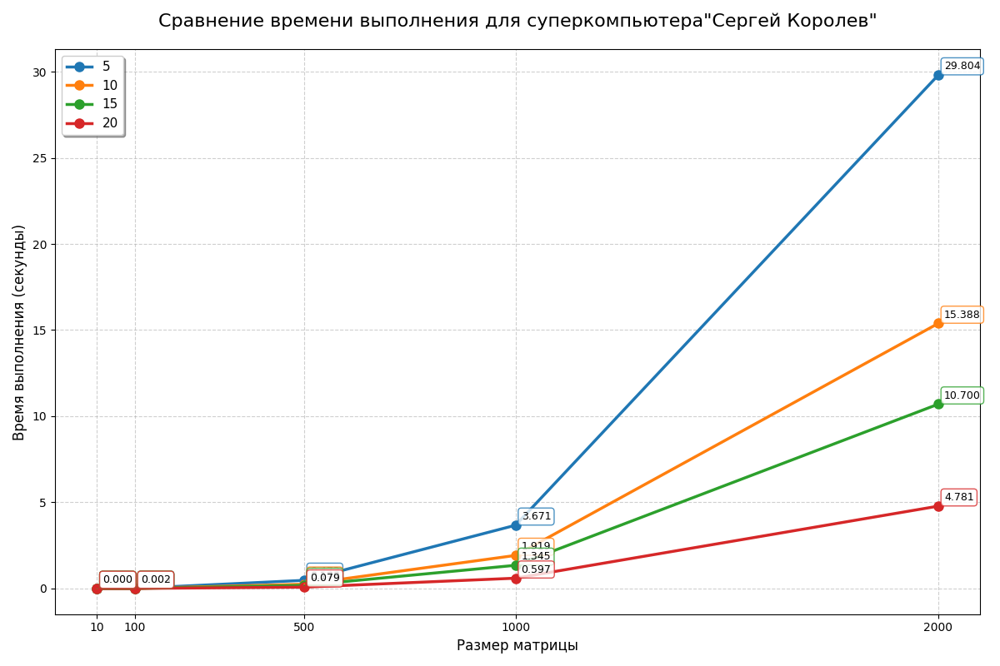
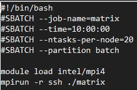

# Отчет по дисциплине "Параллельное программирование"

## Лабораторная работа №3

## Задание
Модифицировать программу из л/р №1 для параллельной работы по технологии MPI.

## Реализация
В функции multiplyMatrixMPI реализованы следующие ключевые оптимизации с использованием MPI:
1. Использование MPI_Scatterv для эффективного распределения строк матрицы A между процессами
2. Построчное вещание матрицы B с помощью MPI_Bcast для обеспечения доступности полной матрицы B на всех процессах

## Результаты для своего компьютера
Как видно из графиков, использование библиотеки MPI позволяет ускорить вычисления в среднем в 3–7 раз по сравнению с последовательным выполнением.

На основании представленных данных можно сделать следующие выыоды:
1. Наибольший прирост производительности наблюдается при переходе от 5 к 10 процессам
2. После 15 процессов прирост эффективности снижается
3. Разница между 15 и 20 процессами показывает уменьшение отдачи от добавления новых процессов

| Характеристика       | Значение                          |
|:---------------------|:----------------------------------|
| ЦП                   | 12th Gen Intel(R) Core(TM) i7-12700H |
| Базовая скорость     | 2.30 ГГц                          |
| Ядра                 | 14                                |
| Число потоков        | 20                                |
| ОЗУ                  | 16.0 ГБ                           |
| Видеокарта           | Intel Iris Xe Graphics            |

## Вывод

Для данной задачи оптимальным выглядит использование 5-10 процессов MPI. Дальнейшее увеличение числа процессов вряд ли даст существенный прирост производительности

## Результаты для суперкомпьютера "Сергей Королев"

Наибольший прирост производительности наблюдается при переходе от 15 к 20 процессам (уменьшение времени выполнения более чем в 2 раза). Эффективность параллелизации улучшается с ростом числа процессов. Результаты показывают, что архитектура "Сергей Королев" эффективно справляется с нагрузкой до 20 процессов. Отсутствие насыщения производительности при 20 процессах позволяет предположить возможность дальнейшего масштабирования.

