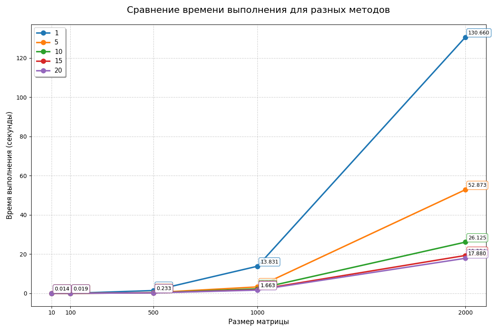
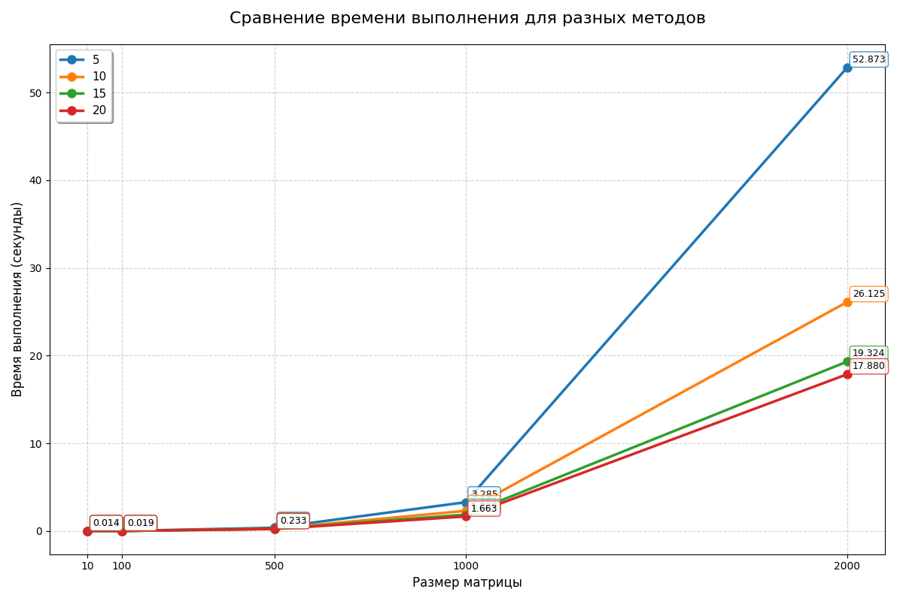

# Отчет по дисциплине "Параллельное программирование"

## Лабораторная работа №3

## Задание
Модифицировать программу из л/р №1 для параллельной работы по технологии MPI.

## Реализация

## Результаты

| Характеристика       | Значение                          |
|:---------------------|:----------------------------------|
| ЦП                   | 12th Gen Intel(R) Core(TM) i7-12700H |
| Базовая скорость     | 2.30 ГГц                          |
| Ядра                 | 14                                |
| Число потоков        | 20                                |
| ОЗУ                  | 16.0 ГБ                           |
| Видеокарта           | Intel Iris Xe Graphics            |